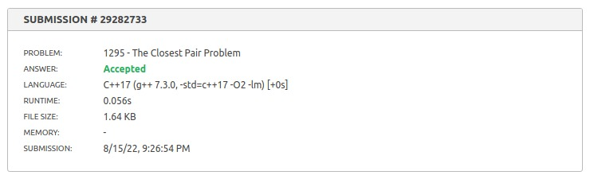
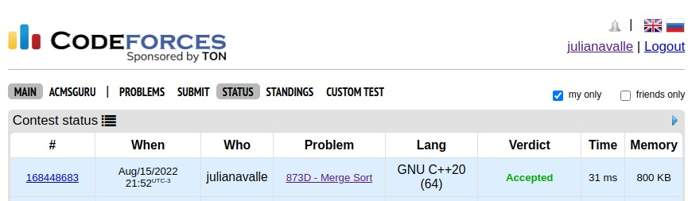

# Dividir e Conquistar - Dupla 17

**Número da Lista**: 17<br>
**Conteúdo da Disciplina**: Dividir e Conquistar<br>

## Alunos
|Matrícula | Aluno |
| -- | -- |
| 18/0124099  |  Juliana Pereira Valle Gonçalves |
| 18/0106805  |  Mateus Cunha Maia |

## Sobre 
Este projeto tem como objetivo resolver exercícios encontrados nas plataformas Beecrowd e Codeforces utilizando o conteúdo de Dividir e Conquistar.

## Screenshots
### Closest Pair
[Link para o problema](https://www.beecrowd.com.br/judge/en/problems/view/1295)



### MergeSort
[Link para o problema](https://codeforces.com/contest/873/problem/D)



## Instalação 
**Linguagem**: C++<br>

Para rodar as soluções, deve-se ter o C++ instalado.

## Uso 
Para rodar localmente os algoritmos, deve-se rodar o comando 

``` shell
    g++ -o teste main.cpp
```
e

``` shell
$ ./teste
```
e, por fim, colocar os inputs de teste disponibilizados.


